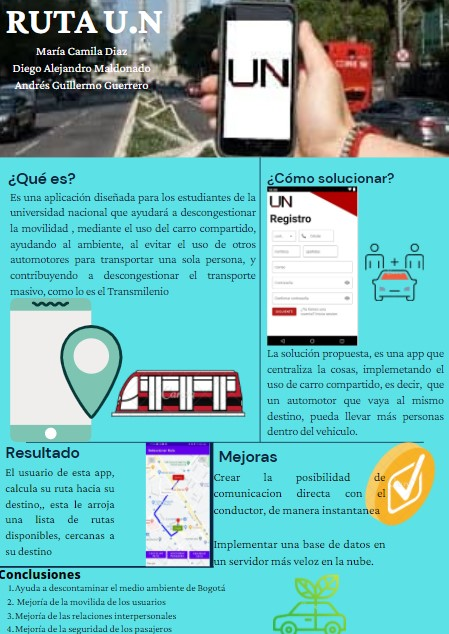

# Ruta-UN
Aplicación móvil para dispositivos Android que facilita la conexión de conductores y pasajeros estilo Uber.
La aplicacion fue diseñada en android studio, haciendo uso de firebase para el almacenamiento de los usuarios y rutas de la aplicion, en el repositorio se puede encontrar el archivo comprimido del proyecto de android studio llamado [Map.rar](Map).

## Video explicativo del funcionamiento de la aplicacion

